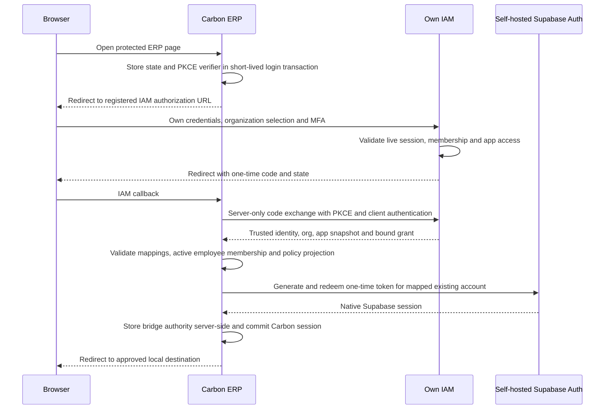

# First-party IAM integration with Carbon: study and implementation steps

Study date: 2026-10-08. Requirement: authenticate using the organization's own
next-auth IAM credentials and MFA. No GitHub, Google, Azure, Keycloak, hosted SSO,
or other external identity provider is needed by the recommended design.

Confirmed customer model: one central IAM owns multiple Carbon customer tenants.
Each customer is a separate IAM organization with explicit Carbon access. Both
shared Carbon deployments and dedicated per-customer deployments are required;
the integration must support them together through an explicit instance registry.

A tenant is an independent manufacturing company, such as an aerospace parts
manufacturer or a plastics manufacturer. Industry is a classification, not an
isolation boundary: two aerospace manufacturers remain separate tenants. Legal
entities, factories and warehouses belong within the appropriate customer's
Carbon operational structure; they do not automatically become IAM tenants.

Carbon is a registered application in IAM, using the proposed slug `carbon-erp`.
Its code remains in `skbasava/carbon`; central IAM remains in `skbasava/next-auth`.
Shared and dedicated Carbon deployments use the same Carbon codebase, with
separate instance configuration, clients and mappings. No repository per customer
or third repository is required for the initial integration.

This is a source-level integration study and proposed implementation sequence.
No Carbon product code was changed, no accounts were migrated, and no integrated
deployment or Carbon test suite was run. Proposed routes, tables, and configuration
below do not exist yet unless explicitly described as existing.

## 1. Repositories examined

- IAM: `skbasava/next-auth`, commit `871c22cae630adf812ace8cac7ec3c3b582dcad4`.
- Carbon: `skbasava/carbon`, commit `3070451ffb7e3b3a2695fe7cb49d1dfaaa810e83`.

Carbon is a React Router application, not a Next.js application. ERP lives in
`apps/erp`; shared authentication lives in `packages/auth`. Supabase Auth (GoTrue)
creates the access and refresh tokens that Carbon expects. Self-hosting GoTrue is
an internal infrastructure dependency, not an external social identity provider.
Removing it would require a substantially broader rewrite of Carbon.

## 2. Verified findings and their implications

| Existing source                                                   | Finding                                                                                                                                        | Integration implication                                                                                                                  |
| ----------------------------------------------------------------- | ---------------------------------------------------------------------------------------------------------------------------------------------- | ---------------------------------------------------------------------------------------------------------------------------------------- |
| IAM `apps/dev/nextjs/auth.ts`, `auth.config.ts`                   | Persisted password credentials, JWT cookie, and authoritative `IamSession`; GitHub/Keycloak providers are also configured                      | Retain credential login and remove or explicitly disable the unwanted providers on both Node and edge configuration paths                |
| IAM `src/lib/iam/app-token.ts`                                    | App JWT uses HS256, issuer `central-iam`, application slug audience, org, permissions, MFA flag, and lifetime at most 900 seconds              | This is an authorization snapshot, not a Supabase login token or an OIDC identity token                                                  |
| IAM `app/api/iam/token/route.ts`, `src/lib/iam/http.ts`           | Token issuance requires the user's IAM cookie, selected org, and exact configured Origin                                                       | Carbon cannot use this endpoint with only a client secret or an arbitrary cross-origin browser request                                   |
| IAM Prisma `Application`                                          | Has integration-secret hash and optional webhook URL                                                                                           | A stored field does not supply a working code exchange, grant renewal, webhook delivery, or introspection API; those need implementation |
| Carbon `packages/auth/src/types.ts`, `services/session.server.ts` | Session includes Supabase access token, refresh token, user, company, company group, expiry, MFA and session clocks                            | Preserve native token/session semantics; do not put an IAM token into the Supabase access-token field                                    |
| Carbon `services/auth.server.ts`, `signInWithPasskey()`           | After passkey verification, server calls admin `generateLink`, redeems `hashed_token` with `verifyOtp`, then builds a normal Supabase session  | A corresponding server-only IAM-authenticated session bridge is feasible using an already-used mechanism                                 |
| Carbon `services/auth.server.ts`, `requirePermissions()`          | Loads native session and company claims; refuses customer/supplier portal accounts on ordinary ERP routes; controls service-role use           | Integrate here and in session validation without removing native guards                                                                  |
| Carbon `lib/supabase/provider.tsx`                                | Browser receives a Supabase access token and uses Supabase/realtime directly                                                                   | Route-only IAM guards are insufficient; database, storage, RPC, and realtime paths must also enforce the intended policy                 |
| Carbon authz SQL helpers                                          | Permissions come from `userPermission`, membership from `userToCompany`, identity from `auth.uid()`; employee role is checked in many policies | Maintain a controlled IAM-to-Carbon permission projection and retain membership/employee restrictions                                    |
| Carbon `services/users.server.ts`                                 | Permission cache uses `permissions:{userId}`, TTL 3600 seconds; claims include company-dependent role                                          | Invalidate on projections and switches; redesign managed-session caching to include company and authorization revision                   |
| Carbon `packages/env/src/index.ts`                                | Provider union is email/google/azure/passkey/sso; default is email/google/azure                                                                | `AUTH_PROVIDERS=iam` is not a supported integration today; add the provider and enforcement before configuring it                        |
| Carbon API v1 `authenticate.server.ts`                            | Accepts Carbon API keys, explicitly refuses non-`crbn_` bearer credentials                                                                     | Existing ERP API v1 will not accept an IAM JWT without an explicit adapter                                                               |
| Carbon `_public+/logout.tsx`, `destroyAuthSession()`              | Clears local cookies                                                                                                                           | Clearing cookies alone is not central IAM logout or complete token revocation                                                            |
| Carbon MFA, callback, ERP layout                                  | Uses GoTrue factors and SAML-specific `ssoProviderId` exemption, plus controlled-environment/company MFA policies                              | Introduce a real IAM authentication classification; never fake a SAML provider ID or treat IAM MFA as GoTrue AAL2                        |

## 3. Recommended architecture

Use a first-party, confidential-client, authorization-code bridge. IAM owns the
password, its MFA challenge, tenant membership and application grants. Carbon
owns ERP profiles, business records, its Supabase sessions, database enforcement,
and ERP-specific record/workflow rules.



This proposal is a private SSO protocol with code/PKCE protections. It is not a
claim that the present IAM is an OAuth/OIDC provider. If general standards-based
interoperability becomes a requirement, implement a complete reviewed provider
with the required OAuth/OIDC contracts instead of naming partial routes OIDC.

Alternatives considered:

- Forward Carbon-entered passwords to IAM: duplicates password handling and is
  less suitable for MFA, session reuse and additional applications. Not recommended.
- Replace GoTrue and all native Carbon auth: changes refresh, browser SDK, RLS,
  storage, realtime, API auth and account provisioning. Much larger project.
- External or separate IdP: unnecessary for this requirement; excluded here.

## 4. Explicit identity and company mapping

Do not make IAM cuid IDs equal to Supabase UUIDs. Do not change existing Carbon
primary keys or attach an IAM account to a privileged Carbon account merely
because the email matches.

Proposed server-managed mappings:

| Record                    | Required content                                                                                                                                                                  |
| ------------------------- | --------------------------------------------------------------------------------------------------------------------------------------------------------------------------------- |
| `iamUserLink`             | IAM issuer + immutable IAM subject + Carbon instance ID, Carbon/Supabase user ID, active flag, admin-reviewed linking metadata                                                    |
| `iamCompanyLink`          | IAM issuer + org ID + Carbon instance ID, Carbon company and company-group IDs, active flag, application slug, management mode                                                    |
| `iamBridgeSession`        | Random Carbon bridge ID, instance, mapped user and company, IAM org/session/grant/client binding, Supabase session ID, expiry/revocation, MFA evidence and authorization revision |
| `iamPermissionProjection` | Company/user mapping, source revision, projected grants, successful-sync time and freshness expiry                                                                                |

Use uniqueness and foreign keys to prevent ambiguous links. For the first release,
map each customer IAM org to one Carbon company in its approved instance. Every company switch needs a fresh validated
IAM org/app grant and its own mapped membership; the `companyId` cookie is a UI
selector, not authority. Preserve the appropriate `companyGroupId`.

Initially provision existing users through an operator-reviewed import. New users
must be invited/approved and created through Carbon's supported account workflow:
Supabase auth account, public user, employee/profile, membership, and baseline
permissions. A bare `userToCompany` insert is not complete ERP provisioning.
Verified email is an additional prerequisite for the bridge, not the primary key.

### Multiple customer tenants

```text
Central IAM
  Customer A / org-A -> approved Carbon instance -> company-A / group-A
  Customer B / org-B -> approved Carbon instance -> company-B / group-B
  Customer C / org-C -> approved Carbon instance -> company-C / group-C
```

In a shared deployment, use a separate Carbon company group per independent
customer and company membership inside that boundary. A customer with several
legal entities can map one IAM org to an explicit set of companies in its own
group, but the grant must also enforce company-specific membership/permissions;
org membership alone must not silently grant all subsidiaries.

In separate deployments, assign an immutable Carbon instance ID and a distinct
confidential client, callback allowlist, feed credential and org allowlist to each
instance. The same IAM user can map to different local Supabase IDs in different
instances. Never assume company IDs or local user IDs are globally unique across
deployments. A client owned by customer A cannot exchange or introspect a grant
for customer B. Bind code, grant, policy export and callback transaction to the
target instance/client. If independently portable tokens are introduced, add a
signed instance/client target and verify it; current app JWTs have only the app
slug audience and do not supply that extra binding.

For the confirmed hybrid deployment, maintain a platform-owned registry such as:

| IAM tenant | Carbon instance | Carbon company/group | SSO client      |
| ---------- | --------------- | -------------------- | --------------- |
| org-A      | shared-01       | company-A / group-A  | shared-01-web   |
| org-B      | shared-01       | company-B / group-B  | shared-01-web   |
| org-C      | dedicated-C     | company-C / group-C  | dedicated-C-web |

The shared client is permitted only the tenants registered to that shared instance;
the dedicated client is permitted only its explicit org allowlist. Client identity
does not authorize a user: every issuance still requires the user's active org
membership and app access. Define one canonical instance target for each tenant
environment; migration to another instance is an operator-controlled mapping and
session cutover, not browser-supplied routing. Store callback URLs in that registry,
not in arbitrary tenant request parameters. Isolate projection/event consumers by
instance and org, and make routing changes revoke or expire old instance grants.

IAM organization members working for a Carbon customer are normally Carbon
`employee` accounts. Carbon's `customer` account role means an ERP customer portal
account; it is not the classification for a tenant that bought the Carbon service.

Required administration split:

- Platform administrator: registers instances/app catalog and links tenants;
  global IAM administration does not automatically grant ERP business-data access.
- Customer tenant administrator: invites/manages users and approved role
  assignments only inside its own IAM org and mapped Carbon tenant.
- ERP user: receives permissions only from that tenant's active membership and
  application assignments. A user in two tenants receives separately evaluated
  grants and sessions; never union permissions across the tenant switch.

Important current IAM limitation: core roles are tenant-scoped, but application
roles/permission definitions are app-scoped and managed by system administrators.
For the first release, use centrally managed immutable application-role templates
with tenant-scoped assignments. If customers must define/edit their own ERP roles,
introduce tenant-scoped application-role definitions and composite constraints;
do not let a tenant administrator mutate a global AppRole used by other customers.

Tenant onboarding sequence: create IAM org -> create the Carbon company/group in
its approved instance -> record immutable mappings -> enable org application access
-> provision/link the tenant administrator -> assign tenant-scoped app roles ->
project permissions -> verify cross-tenant denial -> activate the tenant. Repeat
independently for each customer. Suspension stops renewal, revokes its bridge
sessions and expires/removes its projections without affecting another tenant or
deleting a shared IAM user.

## 5. New IAM interfaces

Names below are proposed; keep them separate from cookie-protected IAM CRUD APIs.

| Interface                              | Caller and purpose                                                                                                                          |
| -------------------------------------- | ------------------------------------------------------------------------------------------------------------------------------------------- |
| `/iam/authorize`                       | Browser authorization UI; registered client, exact callback, state and S256 PKCE challenge; login/MFA/organization selection                |
| `/api/iam/sso/exchange`                | Authenticated Carbon server; consume a one-time code and verifier; return identity, bound application grant and current app token           |
| `/api/iam/sso/renew`                   | Authenticated Carbon server plus bound rotating grant credential; revalidate IAM session, user, org, membership, app access and assignments |
| `/api/iam/sso/introspect`              | Authenticated Carbon server; live status and current revision for a bound user/org/application/session grant                                |
| `/api/iam/sso/revoke`                  | Authenticated Carbon server; revoke its grant/session according to explicit local/global logout semantics                                   |
| App-scoped policy snapshot/change feed | Narrow server credential; export effective permissions and membership/access removals for linked Carbon orgs                                |

Implementation requirements:

1. Register a separate confidential SSO client linked to `carbon-erp`. Existing
   application-registration secrets have no demonstrated exchange handler today;
   validate and bind credentials explicitly rather than assuming they work.
2. Require exact, pre-registered redirect URLs. No arbitrary `redirect_uri`, proxy
   Host derivation, or wildcard callback. Permit loopback HTTP only for local dev.
3. Use at least 32 random bytes for code/state/verifier generation. Store only a
   hash of the authorization code; bind it to client, redirect, PKCE challenge,
   IAM session, org and app; expire in about 60 seconds and consume atomically.
4. GET renders/initiates authorization but does not silently issue credentials.
   The authorization completion POST must have IAM's CSRF/origin protection.
5. Resume login using a server-owned authorization transaction. Do not pass an
   unrestricted return URL through Auth.js sign-in.
6. Recheck live authority at code exchange and renewal, including required MFA.
   Roles changing between consent and exchange must affect the returned grants.
7. Exchange/renew/introspection are server-client endpoints, not cookie-auth APIs.
   Give them separate authentication/rate limits. Do not disable `requireOrigin`
   globally or pretend to possess the user's IAM cookie by forwarding cookies.
8. Use a rotated server-side grant credential, hashed at IAM and bound to the
   original live IAM session. Client authentication alone must not mint tokens
   for arbitrary users. Detect replay; revoke the affected grant family.
9. Never return a password, IAM cookie, raw session credential, Supabase service
   key or long-lived token through callback query parameters. Only code/state
   travel through the browser; scrub them from logs, referrers and history.

The existing app JWT has no email, auth-time, authentication-method or identity
linking claim. Return authoritative identity metadata over the authenticated
server exchange and bind its subject/org to the validated app token. Do not
invent these fields by decoding an unverified browser payload.

## 6. Carbon native-session bridge

Add a dedicated `iam.server.ts` service rather than calling the development-only
`signInWithBypassEmail()` or exporting an email-only impersonation endpoint.

After successful exchange:

1. Resolve the immutable user link and org/company link.
2. Check active IAM authority, active local user, employee membership, and any
   enterprise/company restrictions. Reject unlinked, inactive or portal accounts.
3. Ensure current permissions have been projected successfully before login.
4. Fetch the mapped Supabase account by its ID; obtain its canonical email.
5. Call admin `generateLink({type:'magiclink', email})` and immediately redeem
   `properties.hashed_token` using `verifyOtp` on a dedicated server client.
6. Assert the returned Supabase user ID equals the mapped ID. If it differs,
   reject, revoke the unintended session, and audit; never relink on the fly.
7. Read and validate the real Supabase `session_id`, store the bridge binding,
   construct Carbon's normal session using the selected mapped company and group,
   and commit via the existing session/cookie helpers.
8. Invalidate the short-lived login transaction and redirect to an allowlisted
   relative ERP destination.

This token generation is an internal credential minting operation: it sends no
email and requires no Google/GitHub account. The service-role key is privileged;
keep it confined to the verified bridge. Neither an unverified email nor a client
secret alone may reach this operation.

Keep Supabase access-token refresh separate from IAM grant renewal. Refreshing a
Supabase token does not prove that IAM still permits ERP access. Add a small bridge
reference/auth-source marker to Carbon's session and store IAM tokens, renewal
credentials, and detailed authority server-side. Do not put app permission arrays
or additional long-lived tokens into the already-populated signed cookie.

## 7. Permissions and row-level security

Use a dedicated application slug `carbon-erp` to avoid treating the existing
generic `erp` demo role catalog as Carbon's complete policy.

Recommended first mapping uses Carbon's actual permission vocabulary:

| IAM permission                 | Carbon projected key                                              |
| ------------------------------ | ----------------------------------------------------------------- |
| `carbon-erp:purchasing:view`   | `purchasing_view`                                                 |
| `carbon-erp:purchasing:create` | `purchasing_create`                                               |
| `carbon-erp:purchasing:update` | `purchasing_update`                                               |
| `carbon-erp:purchasing:delete` | `purchasing_delete`                                               |
| `carbon-erp:inventory:view`    | `inventory_view` after confirming each route's current module key |

Expand from an inventory of actual `requirePermissions` calls and generated RLS
rules, not assumptions about module labels. Existing `erp:invoice:approve` must
not automatically become broad `purchasing_update`. Approval is a distinct
workflow operation needing a dedicated server/action check and protection against
equivalent direct database updates.

Carbon's membership role (`employee`, `customer`, `supplier`) is an account
classification; IAM roles such as finance-manager are bundles of grants. Do not
replace `employee` with an application role string. Enforce employee/portal limits,
company and group scope, row ownership, workflow state and plan restrictions.

For IAM-managed companies, IAM is the source of managed grants. Carbon holds a
derived projection of those grants for its existing checks and RLS. Local editors
must not add privileges to that managed scope. Changes use an outbox/change feed,
idempotent consumer and atomic projection replacement; remove revoked grants as
well as adding new ones. Preserve unrelated companies and their explicitly
separate local grants. Include revision ordering and a full reconciliation job.

Invalidate `permissions:{userId}` and other affected caches after updates and
company switching. Give managed cache entries user+company+revision identity and
a bounded TTL; cache invalidation is not a substitute for a freshness limit.

### Direct Supabase access is a release gate

Browser tokens can bypass React Router loaders. For bounded live revocation,
add server-maintained authority leases and enforce them in the relevant database
authorization helpers and policies, including membership/role-only helpers,
storage, permitted RPCs and realtime paths. For IAM-managed access require a
valid matching bridge/Supabase session binding plus an unexpired user-company
policy lease. Unknown bindings fail closed. Apply these additions in Carbon's
`packages/database/src/authz` source and generate the migration; do not hand-edit
an already generated migration or only protect one table.

A proposed starting objective is a 60-second maximum IAM authority lease, renewed
after live introspection; IAM outage stops renewal and eventually blocks managed
access. Use a tested clock-skew allowance within the stated bound. An outbox event
can revoke earlier. This is a target, not a currently implemented guarantee.

Verify GoTrue keeps the session ID stable across refresh on the deployed version;
if it changes, an authenticated refresh must update the binding before admitting
the new token. Do not fall back to user-only matching. A central-session revocation
must revoke the relevant bridge rows so an already-issued Supabase token cannot
keep using RLS even if its cryptographic expiry is later.

Do not claim immediate revocation for previously downloaded data, existing
realtime subscriptions, or in-flight requests. Inventory these paths and document
their actual disconnection/recheck behavior. If any data path cannot enforce the
lease, explicitly proxy/restrict that path or report its longer revocation window.

## 8. MFA, sessions, logout and company switching

- Build IAM organization-selection and MFA-challenge UI; MFA APIs exist but a
  complete ERP-oriented login/step-up UI is not present today.
- Add explicit authentication source and verified IAM MFA evidence, including
  authentication time and method from live authority. Do not set
  `ssoProviderId` to a made-up value to skip Carbon gates.
- IAM `mfaVerified` does not create Supabase AAL2. Any policy depending on
  GoTrue AAL2 still needs native step-up or a separately reviewed policy change.
- Initially retain Carbon MFA where required. A later reviewed change can make
  IAM own MFA for managed companies while preserving controlled-environment and
  sensitive-operation requirements. This may require fresh-auth timestamps and
  step-up APIs that the current snapshot token lacks.
- Preserve idle lock, absolute lifetime, console pin-in and user/session actor
  distinction. First release can exclude MES console mode; reject unsupported
  authentication paths instead of silently exempting them.
- Carbon local logout revokes its bridge/grant and Supabase session, then clears
  cookies. Provide a distinct global logout path to end IAM SSO and all linked
  sessions; define whether other apps should be logged out.
- Central logout, deactivation, org removal, app disable and role removal must
  propagate through the change feed and authority leases. Never rely solely on
  the 15-minute offline app token expiry.
- On company switch, validate the selected org and company mapping, obtain fresh
  authority, update the bridge/session coherently, and invalidate claims. Never
  pick the first company as an authorization decision.

## 9. Signing and secrets

Current HS256 app verification means Carbon holds a secret capable of minting
valid IAM app tokens. For a controlled proof of concept with mutually trusted
operators this can use the existing verifier. For production separation, implement
asymmetric app signing (for example RS256/ES256) with key ID, public-key retrieval,
rotation and a strict verifier; that capability is not implemented today. For
customer-operated independent Carbon deployments, do not distribute the shared
HS256 signing secret: use asymmetric verification or authenticated online IAM
verification/introspection with instance/org restrictions. Public-key possession
must not grant the ability to create a token for another customer.

Carbon must not receive IAM `AUTH_SECRET`, password hashes, MFA encryption keys,
IAM database credentials or IAM's private signing key. Supabase service-role and
signing credentials remain Carbon-only. Keep a distinct SSO client credential
and authenticated feed/introspection scopes, rotated independently.

## 10. Concrete implementation sequence

1. **Inventory and freeze scope.** Start ERP employees, one org/company, purchasing
   view/create/update/delete, no MES console or portal users. Inventory route,
   browser, storage, RPC, realtime, service-role and API-key entry points. Record
   the existing permissions and a deny-by-default mapping manifest.
2. **Prepare local services.** Run IAM on 127.0.0.1:3001 and Carbon at its actual
   generated URL. Keep IAM Prisma DB and Carbon Supabase DB separate. Use separate
   Redis namespaces/instances. Carbon `crbn up` owns generated `.env.local`; put
   additions in supported operator configuration, not manual generated-file edits.
3. **Disable unwanted authentication paths.** IAM credential-only configuration
   on edge and Node. Carbon add the `iam` provider to env and gate types, UI and
   endpoints. Enforce IAM-only for managed users/companies on callback, email,
   signup, OAuth, passkey, refresh and unlock paths as appropriate, not just buttons.
   Disable social providers at GoTrue deployment level too. Do not disable internal
   email token redemption needed by the verified session bridge. Evaluate external
   SMTP and bot-challenge dependencies separately if the deployment must be wholly
   private; they are not SSO providers.
4. **Create mappings and provision pilot accounts.** Admin-reviewed IAM subject to
   Carbon user link and org to company link. Use Carbon's complete employee creation
   workflow. Keep existing ERP primary keys and ownership/history unchanged.
5. **Configure IAM application catalog.** Register `carbon-erp`; resources with
   actual module actions; application roles; per-org access; member assignments.
   Catalog seeding alone does not create users, org access or member app grants.
6. **Implement IAM authorization and exchange.** New client/code/grant persistence,
   PKCE/state/callback allowlist, credentials/MFA UI, atomic code redemption and
   server-client authentication. Add live renewal/introspection and revocation.
7. **Implement Carbon bridge.** Login-start/callback handlers, server-only native
   session minting, immutable-ID assertions, bridge store and selected-company
   handling. Test through browser redirects on separate local ports.
8. **Implement projection and database gates.** Versioned scoped export, IAM
   transactional outbox, Carbon consumer/reconciliation, atomic revocations,
   managed-only local editor restrictions, cache invalidation and lease enforcement
   on all covered data surfaces. Do this before admitting real ERP data.
9. **Wire lifecycle and MFA.** Separate IAM/Supabase renewals, freshness checks,
   company switches, local/global logout and central revocation. Review native MFA
   coexistence and add IAM step-up before sensitive actions.
10. **Integrate APIs deliberately.** Leave API v1 Carbon keys intact initially;
    do not reinterpret arbitrary bearer JWTs as those keys. If IAM bearer support
    is required, add a separate verified context adapter with company/user mapping,
    employee restrictions, operation scopes, rate limits and existing permission
    checks. Inventory jobs, integrations and service-role operations separately.
    Native machine keys are a separate authority surface, not automatically
    governed by a human IAM session. For managed companies, prohibit unmanaged
    key creation and wider-than-approved scopes; explicitly register, audit and
    revoke any retained machine integrations. A claim of fully centralized IAM
    requires their lifecycle and scope policy to be integrated too.
11. **Run release tests.** Unit + integration + browser + direct Supabase tests in
    section 12. Validate actual installed GoTrue behavior and migration generation.
12. **Pilot and roll out.** Staging first, then one company. Observe audit and sync
    lag; expand modules only after direct-access denial and revocation pass. Retain
    an audited operator recovery method that cannot act as a general user bypass.

## 11. Files to change

| Repository | Main implementation locations                                                                                                                                                                                                                                                                                                                                      |
| ---------- | ------------------------------------------------------------------------------------------------------------------------------------------------------------------------------------------------------------------------------------------------------------------------------------------------------------------------------------------------------------------ |
| IAM        | `apps/dev/nextjs/auth.config.ts`, `auth.ts`, Prisma schema/additive migrations; new authorization UI; new server-client SSO endpoints and services; transactional outbox beside authority mutations; token signing/verifier if upgraded                                                                                                                            |
| Carbon     | `packages/env/src/index.ts`; `packages/auth/src/types.ts`, new `services/iam.server.ts`, `services/session.server.ts`, `services/auth.server.ts`, `services/company.server.ts`, claims/cache helpers; ERP `_public+` login/start/callback/logout/refresh/unlock; new projection services/tables; `packages/database/src/authz`; managed-company permission editors |

Existing Carbon SAML implementation in `packages/ee` is reference material only;
the recommended bridge does not need a commercial SAML provider or changes to the
enterprise SSO routes. Review existing edition gates during implementation.

Proposed configuration, **not supported today**:

```dotenv
# Carbon server configuration; register through @carbon/env.
IAM_ENABLED=true
IAM_BASE_URL=http://127.0.0.1:3001
IAM_CLIENT_ID=carbon-erp-web
IAM_CLIENT_SECRET=<securely-injected-client-credential>
IAM_APPLICATION_SLUG=carbon-erp
IAM_CALLBACK_URL=<actual-carbon-origin>/iam/callback
AUTH_PROVIDERS=iam
```

Development callbacks must exactly match registered URLs. Production uses HTTPS.
No secrets go in `getBrowserEnv`. Proposed signing/feed keys are supplied through
secure environment settings, never committed or placed in a user-facing URL.

## 12. Test and acceptance matrix

| Area               | Required evidence                                                                                                                                                                                                               |
| ------------------ | ------------------------------------------------------------------------------------------------------------------------------------------------------------------------------------------------------------------------------- |
| First-party login  | Own credentials work; password never sent to Carbon; no external social/IdP redirect; existing IAM session can be reused                                                                                                        |
| Code security      | Wrong/missing state or PKCE, incorrect client/callback, expired code and replay rejected; concurrent redemption succeeds once                                                                                                   |
| Identity           | Unknown link, inactive account, unverified email, wrong returned Supabase ID and ambiguous mapping rejected                                                                                                                     |
| Tenancy            | Wrong org/company and forged company cookie rejected; company switches require active mapped membership; another company's projection unchanged                                                                                 |
| Multiple customers | Customer A admin cannot change B roles, mappings, users, feeds or grants; two-tenancy user does not carry A permissions into B; group-level access cannot escape customer boundary; wrong-instance callback/code/token rejected |
| Permissions        | Viewer reads only; missing create/update/delete denied; unknown permission denied; employee/portal and workflow checks retained                                                                                                 |
| Direct data        | Same denial via browser Supabase, PostgREST/RPC, storage and relevant realtime channels; service-role paths remain gated                                                                                                        |
| Revocation         | Role removal, org removal, app disable and user/session revoke deny within the measured target; stale token and cache cannot restore grants                                                                                     |
| Outage             | Failed IAM/Redis/feed/DB operations do not mint authority; managed leases expire; existing unrelated companies retain their intended behavior                                                                                   |
| Lifecycle          | Supabase refresh does not revive revoked IAM access; company/user/grant binding preserved; idle lock/absolute caps maintained                                                                                                   |
| MFA                | Required IAM challenge enforced; pending login not authorized; sensitive step-up required; no fake SAML exemption or implicit AAL2 assertion                                                                                    |
| Logout             | Local and global logout have tested different effects; old Supabase access/refresh tokens and central grant cannot reopen denied access                                                                                         |
| Provisioning       | Repeated import/consumer safe; removed grants removed; local privilege edits blocked; no first-login automatic elevated role                                                                                                    |
| API                | Existing Carbon API-key scopes/rate limits unchanged; proposed bearer adapter cannot bypass operation or company checks                                                                                                         |
| UI                 | Credentials-only login, clear denied-access/session-expired states, no callback secrets in URL history/logs                                                                                                                     |

Relevant existing commands (run after installation with the appropriate secrets):

```sh
# Carbon, from repository root
pnpm --filter @carbon/auth typecheck
pnpm --filter @carbon/auth test
pnpm --filter @carbon/env typecheck
pnpm --filter @carbon/database test
pnpm --filter erp typecheck
pnpm --filter erp test

# Generate/check authz changes from the canonical source; sync mutates the DB.
pnpm --filter @carbon/database authz migration iam_bridge
pnpm --filter @carbon/database authz check

# IAM, from apps/dev/nextjs; integration suites require dedicated test DB
pnpm test:iam
pnpm test:iam:integration
pnpm typecheck:iam
pnpm build
pnpm test:iam:http --browser
```

Add the integration-specific tests above; these existing suites alone cannot
validate an SSO bridge that has not been implemented. Ensure targeted tests
actually execute rather than interpreting a zero-test run as passing.

## 13. Rollout and rollback

Use per-company managed-mode flags and begin with shadow comparison before grant
cutover. Never union old local grants into IAM-managed permissions as a temporary
fix. Snapshot existing native permissions and mappings; make projection upgrades
transactional and reversible. A rollback is an explicit operator action restoring
the approved previous auth mode and permissions, not an automatic outage bypass.
Invalidate bridge sessions on rollback to avoid mixed authority.

Completion means one user signs in with IAM credentials/MFA, accesses only its
mapped company's permitted ERP operations, gets denied through direct database
paths too, renews safely, and loses access on revocation within the demonstrated
bound. Merely hiding Google buttons or accepting an IAM JWT is not completion.

## 14. Source links

- [Carbon auth/session/minting](https://github.com/skbasava/carbon/blob/3070451ffb7e3b3a2695fe7cb49d1dfaaa810e83/packages/auth/src/services/auth.server.ts)
- [Carbon session lifecycle](https://github.com/skbasava/carbon/blob/3070451ffb7e3b3a2695fe7cb49d1dfaaa810e83/packages/auth/src/services/session.server.ts)
- [Carbon browser Supabase provider](https://github.com/skbasava/carbon/blob/3070451ffb7e3b3a2695fe7cb49d1dfaaa810e83/packages/auth/src/lib/supabase/provider.tsx)
- [Carbon generated authorization source](https://github.com/skbasava/carbon/tree/3070451ffb7e3b3a2695fe7cb49d1dfaaa810e83/packages/database/src/authz)
- [Carbon provider configuration](https://github.com/skbasava/carbon/blob/3070451ffb7e3b3a2695fe7cb49d1dfaaa810e83/packages/env/src/index.ts)
- [Carbon API v1 authentication](https://github.com/skbasava/carbon/blob/3070451ffb7e3b3a2695fe7cb49d1dfaaa810e83/apps/erp/app/routes/api%2B/v1%2B/lib/authenticate.server.ts)
- [IAM application tokens](https://github.com/skbasava/next-auth/blob/871c22cae630adf812ace8cac7ec3c3b582dcad4/apps/dev/nextjs/src/lib/iam/app-token.ts)
- [IAM API and offline integration documentation](https://github.com/skbasava/next-auth/blob/871c22cae630adf812ace8cac7ec3c3b582dcad4/apps/dev/nextjs/IAM.md)

The examined files establish feasibility and identify the required changes.
Runtime behavior of the proposed bridge and its revocation guarantee remains to
be proved by implementation and the acceptance tests above.
